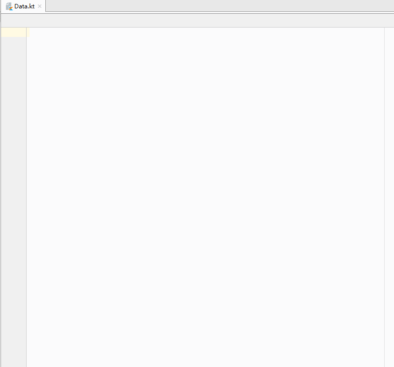

# json2dataclass
一个 IEDA 插件，用来将 json 转换成 kotlin 的 data class ，只是个简单的工具，实现使用 [gson](https://github.com/google/gson)  
插件开发入门之作，并没有界面……  
a idea plugin use for convert json to kotlin data class，implement by [gson](https://github.com/google/gson)  

